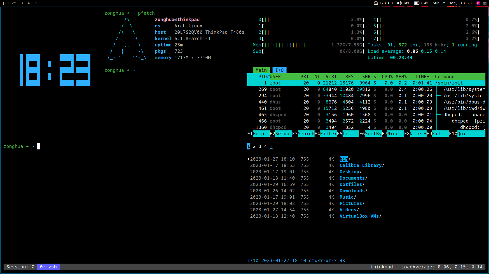

# dotfiles

[](https://github.com/zouzonghua/dotfiles/blob/main/LICENSE)



## installation

```sh
sh <(curl -L https://github.com/zouzonghua/dotfiles/raw/main/install.sh)
```

## vimium

### vim key mappings

```sh
""""""""""""""""""""""""""""""""""""""""""""""""""""""""""""""""""""""""""""""""
"" key mappings
""""""""""""""""""""""""""""""""""""""""""""""""""""""""""""""""""""""""""""""""

unmapAll

""""""""""""""""""""""""""""""""""""""""""""""""""""""""""""""""""""""""""""""""
"" Navigating the page
""""""""""""""""""""""""""""""""""""""""""""""""""""""""""""""""""""""""""""""""
map j scrollDown
map k scrollUp
map <c-d> scrollPageDown
map <c-u> scrollPageUp
map <c-f> scrollFullPageDown
map <c-b> scrollFullPageUp
map G scrollToBottom
map gg scrollToTop
map f LinkHints.activateMode
map F LinkHints.activateModeToOpenInNewTab
map gi focusInput
map yf LinkHints.activateModeToCopyLinkUrl
map yy copyCurrentUrl
map p openCopiedUrlInCurrentTab
map P openCopiedUrlInNewTab
map r reload

""""""""""""""""""""""""""""""""""""""""""""""""""""""""""""""""""""""""""""""""
"" Using the vomnibar
""""""""""""""""""""""""""""""""""""""""""""""""""""""""""""""""""""""""""""""""
map O Vomnibar.activate
map o Vomnibar.activateInNewTab

""""""""""""""""""""""""""""""""""""""""""""""""""""""""""""""""""""""""""""""""
"" Using find
""""""""""""""""""""""""""""""""""""""""""""""""""""""""""""""""""""""""""""""""
map / enterFindMode
map n performFind
map N performBackwardsFind

""""""""""""""""""""""""""""""""""""""""""""""""""""""""""""""""""""""""""""""""
"" Navigating history
""""""""""""""""""""""""""""""""""""""""""""""""""""""""""""""""""""""""""""""""
map u goBack
map <c-r> goForward

""""""""""""""""""""""""""""""""""""""""""""""""""""""""""""""""""""""""""""""""
"" Manipulating tabs
""""""""""""""""""""""""""""""""""""""""""""""""""""""""""""""""""""""""""""""""
map <c-h> previousTab
map <c-l> nextTab
map <c-c> removeTab
map ,hh closeTabsOnLeft
map ,ll closeTabsOnRight
map << moveTabLeft
map >> moveTabRight

""""""""""""""""""""""""""""""""""""""""""""""""""""""""""""""""""""""""""""""""
"" Miscellaneous
""""""""""""""""""""""""""""""""""""""""""""""""""""""""""""""""""""""""""""""""
map ? showHelp

```

### search engines

```sh
""""""""""""""""""""""""""""""""""""""""""""""""""""""""""""""""""""""""""""""""
"" Search engines
""""""""""""""""""""""""""""""""""""""""""""""""""""""""""""""""""""""""""""""""
w: https://www.wikipedia.org/w/index.php?title=Special:Search&search=%s Wikipedia
b: https://www.baidu.com/s?wd=%s Baidu
g: https://github.com/search?q=%s Github
y: https://www.youtube.com/results?search_query=%s Youtube
ten: https://translate.google.com/?source=osdd#auto|en|%s Google Translator
tcn: https://translate.google.com/?source=osdd#auto|zh-CN|%s Google Translator
ttw: https://translate.google.com/?source=osdd#auto|zh-TW|%s Google Translator

```

## Arch Linux

### 分区

```sh
gdisk /dev/sda
```

格式化分区

```sh
Command (? for help):o
```

创建 EFI 分区
```sh
Command (? for help):n
Permission number: 1
First sector     : enter
Last sector      : +512M
Hex code or GUID : EF00
```

创建 SWAP 分区
```sh
Command (? for help):n
Permission number: 2
First sector     : enter
Last sector      : +8G
Hex code or GUID : 8200
```

创建 Root 分区
```sh
Command (? for help):n
Permission number: 3
First sector     : enter
Last sector      : enter
Hex code or GUID : 8300
```

格式化挂载分区
```sh
mkfs.vfat -F 32 /dev/sda1
mkswap /dev/sda2
mkfs.ext4 /dev/sda3
mount /dev/sda3 /mnt
mkdir /mnt/boot
mount /dev/sda1 /mnt/boot
swapon /dev/sda2
```

### 配置网络

禁用 reflector 服务
```sh
systemctl stop reflector.service
```

连接网络
```sh
iwctl
device list
station wlan0 scan
station wlan0 get-networks
station wlan0 connect wifi-name
exit
```

修改软件源
```sh
vim /etc/pacman.d/mirrorlist
```

### 安装系统

安装基础软件包
```sh
pacstrap /mnt base base-devel linux linux-firmware vim dhcpcd iwd intel-ucode
```

生成 fstab 文件
```sh
genfstab -U -p /mnt >> /mnt/etc/fstab
```

切换系统环境
```sh
arch-chroot /mnt
```

配置主机名
```sh
echo thinkpad > /etc/hostname
```

vim /etc/hosts

```sh
127.0.0.1   localhost
::1         localhost
127.0.1.1   thinkpad.localdomain	thinkpad
```

硬件时间设置
```sh
hwclock --systohc
```

配置时区

vi /etc/locale.gen
```sh
en_US.UTF-8 UTF-8
zh_CN.UTF-8 UTF-8

```

生成 locale
```sh
locale-gen
```

```sh
echo 'LANG=en_US.UTF-8'  > /etc/locale.conf
ln -sf /usr/share/zoneinfo/Asia/Shanghai /etc/localtime
```

### 配置用户

创建用户
```sh
useradd -m -G wheel -s /bin/bash ${USER}
```

设置密码
```sh
passwd ${USER}
```

配置权限

```sh
visudo
Defaults env_keep += “ HOME ”
%wheel ALL=(ALL) ALL
```

### 安装 grub

```sh
pacman -S grub efibootmgr
grub-install --target=x86_64-efi --efi-directory=/boot --bootloader-id=ARCH
vim /etc/default/grub
grub-mkconfig -o /boot/grub/grub.cfg
reboot
```

### 配置网络

开启 dhcp,iwd 服务

```sh
systemctl enable --now dhcpcd
systemctl enable --now iwd
```

vim /etc/dhcpcd.conf

```sh
interface wlan0
static ip_address=192.168.1.6/24
static routers=192.168.1.254
static domain_name_servers=192.168.1.254
```
### 输入法和字体

```sh
sudo pacman -S fcitx5-im fcitx5-rime
sudo pacman -S noto-fonts noto-fonts-cjk noto-fonts-emoji noto-fonts-extra ttf-noto-nerd
```

### 音量管理

```sh
sudo pacman -S alsa-utils pulseaudio pavucontrol
```
